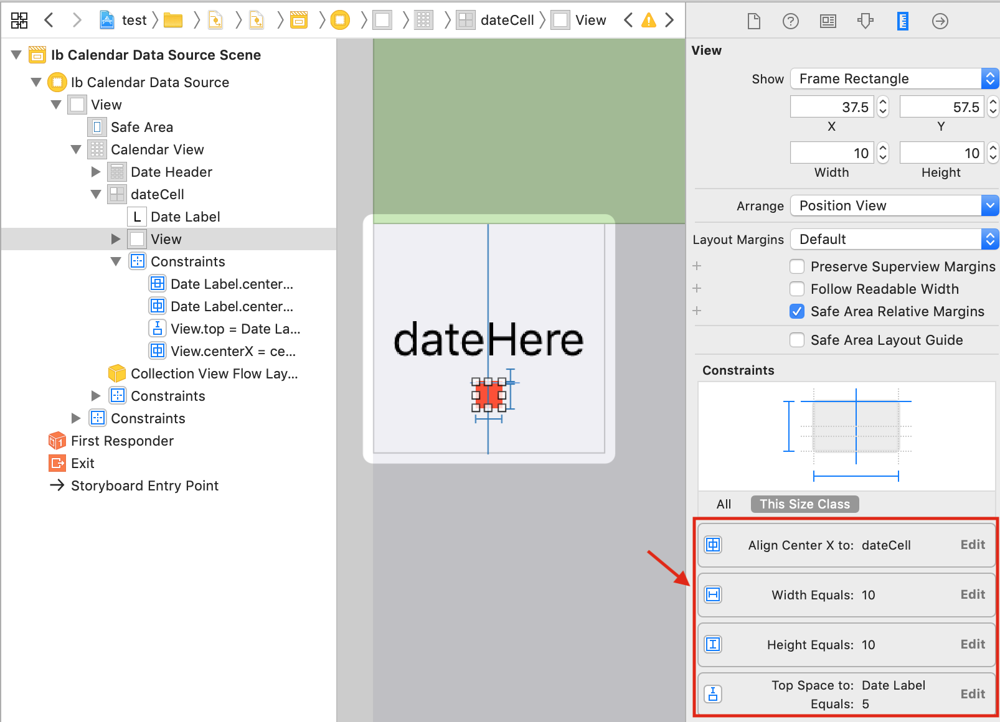
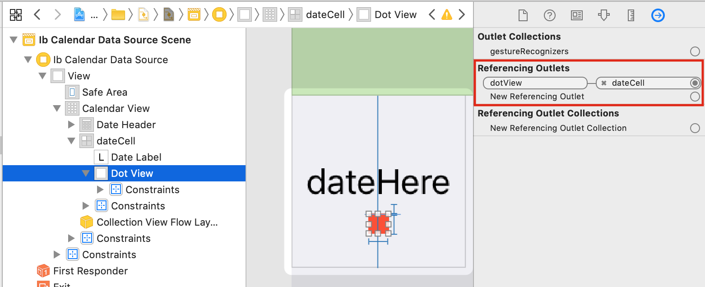
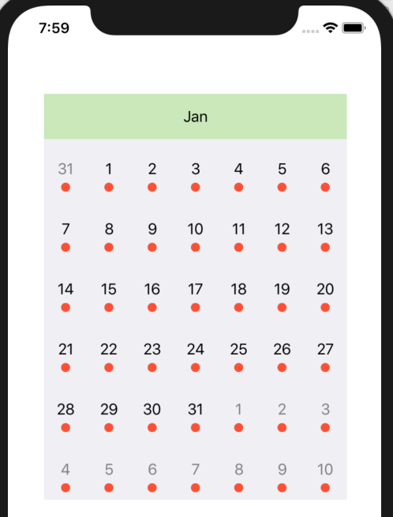

# Adding Events

> [!WARNING]
> This documentation requires assistance, particularly updating to SwiftUI. If possible, please submit a PR to help improve the documentation

Adding events – or adding a dot-view to signify an event on a date cell – is exactly the same as you would add a custom view to a UITableView or UICollectionView cell.

In the case of UICollectionView/UITableView, you would design the cell in the cellForItemAtIndexPath function based on the cell’s index, in relation the the dataSource’s index.

In the case of this library, it is exactly the same. The only difference is that instead of using a cell’s associated index, we use a cell’s associated date.

# Creating the dot view

First, for better viewing, increase the constraint height of the calendar to 450.


Next, create the red `dotView` as seen below. Take note of the constraints used.



The dotView needs to look round, therefore set a cornerRadius for it. I use storyboard for simplicity, but code may be preferred.


Add an IBOutlet for the the dotView. Go to the DateCell class and add this code.

```swift
import JTAppleCalendar
import UIKit

class DateCell: JTAppleCell {
    @IBOutlet var dateLabel: UILabel!
    @IBOutlet var dotView: UIView!
}
```

Now connect your dotView IBOutlet on storyboard as seen below.



Run your app. It should look like this



## Attaching events to your dotView

Now we only want the dot view to be visible for specific dates in our dataSource. The calendar library operates on dates and not indexes, therefore the dataSource should relate every cell to dates.

Lets add a DateFormatter to be used globally for events & the dataSource dictionary. DataSource will be explained below.

```swift
class ViewController: UIViewController {
    @IBOutlet var calendarView: JTAppleCalendarView!

    var calendarDataSource: [String:String] = [:]
    var formatter: DateFormatter {
        let formatter = DateFormatter()
        formatter.dateFormat = "dd-MMM-yyyy"
        return formatter
    }
```

Modify the `configureCalendar` function

```swift
extension ViewController: JTAppleCalendarViewDataSource {
    func configureCalendar(_ calendar: JTAppleCalendarView) ->; ConfigurationParameters {
        let startDate = formatter.date(from: "01-jan-2018")!
        let endDate = Date()
        return ConfigurationParameters(startDate: startDate, endDate: endDate)
    }
}
```

Add this line of code

```swift
func configureCell(view: JTAppleCell?, cellState: CellState) {
    guard let cell = view as? DateCell  else { return }
    cell.dateLabel.text = cellState.text
    handleCellTextColor(cell: cell, cellState: cellState)
    handleCellEvents(cell: cell, cellState: cellState)
}
```

## The dataSource

Finally, let’s talk about population of the dataSource. Add the following code.

```swift
func populateDataSource() {
    // You can get the data from a server.
    // Then convert that data into a form that can be used by the calendar.
    calendarDataSource = [
        "07-Jan-2018": "SomeData",
        "15-Jan-2018": "SomeMoreData",
        "15-Feb-2018": "MoreData",
        "21-Feb-2018": "onlyData",
    ]
    // update the calendar
    calendarView.reloadData()
}
```

We need some way to associate the dateCells with the datasource. The best way to identify a cell is by Date, therefore I chose a dataSource with a date string as the key.

Now create the following function. It is responsible for determining the visibility of the dotView. If the date has an event, it will be visible, else it will be hidden.

```swift
func handleCellEvents(cell: DateCell, cellState: CellState) {
    let dateString = formatter.string(from: cellState.date)
    if calendarDataSource[dateString] == nil {
        cell.dotView.isHidden = true
    } else {
        cell.dotView.isHidden = false
    }
}
```

To test this code, finally add this line of code and run the app.

```swift
override func viewDidLoad() {
    super.viewDidLoad()
    calendarView.scrollDirection = .horizontal
    calendarView.scrollingMode   = .stopAtEachCalendarFrame
    calendarView.showsHorizontalScrollIndicator = false

    populateDataSource()
}
```

## Next Steps

Learn more about [implementing week numbers](../implementing-week-numbers/Implementing%20week%20numbers.md)
