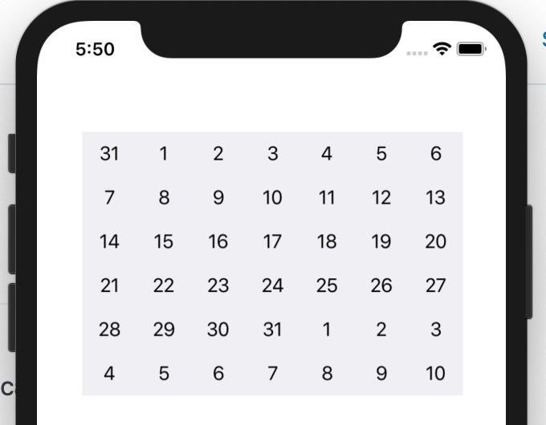
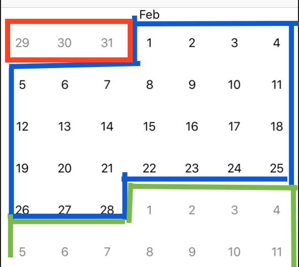
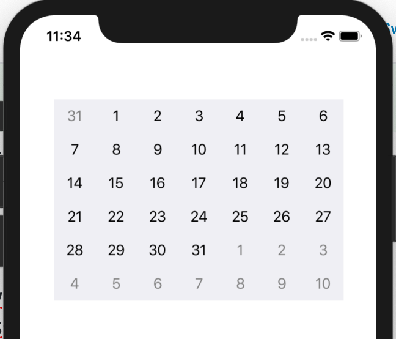
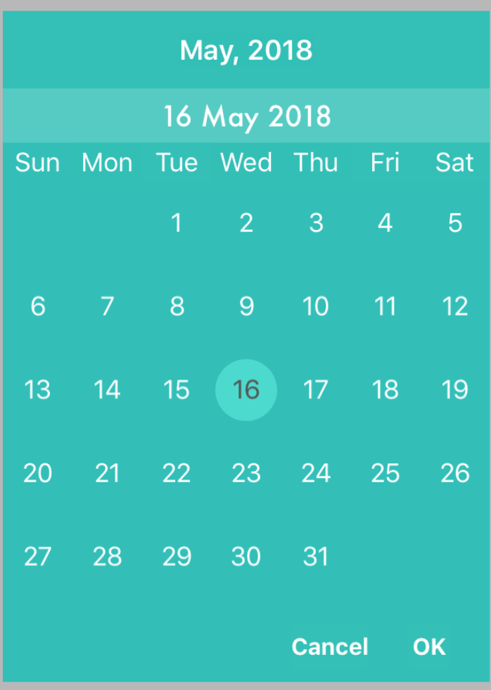

# Configuring inDates monthDates outDates

> [!WARNING]
> This documentation requires assistance, particularly updating to SwiftUI. If possible, please submit a PR to help improve the documentation

If you followed the [building from scratch tutorial](../../build-calendar/Build%20A%20Calendar%20From%20Scratch.md), your calendar should look like this. You would also know what inDates/outDates are.



## Set fixed inDates/outDates/monthDates

The calendar is difficult to read with inDates/outDates/monthDates the same color. Lets change that. Create the following 2 functions.

```swift
func configureCell(view: JTAppleCell?, cellState: CellState) {
   guard let cell = view as? DateCell  else { return }
   cell.dateLabel.text = cellState.text
   handleCellTextColor(cell: cell, cellState: cellState)
}

func handleCellTextColor(cell: DateCell, cellState: CellState) {
   if cellState.dateBelongsTo == .thisMonth {
      cell.dateLabel.textColor = UIColor.black
   } else {
      cell.dateLabel.textColor = UIColor.gray
   }
}
```



- Blue indicates `thisMonth`
- Red indicates `previousMonthWithinBoundary`
- Green indicates `followingMonthWithinBoundary`

Rewrite the following functions

```swift
func calendar(_ calendar: JTAppleCalendarView, cellForItemAt date: Date, cellState: CellState, indexPath: IndexPath) -> JTAppleCell {
   let cell = calendar.dequeueReusableJTAppleCell(withReuseIdentifier: "dateCell", for: indexPath) as! DateCell
   self.calendar(calendar, willDisplay: cell, forItemAt: date, cellState: cellState, indexPath: indexPath)
   return cell
}

func calendar(_ calendar: JTAppleCalendarView, willDisplay cell: JTAppleCell, forItemAt date: Date, cellState: CellState, indexPath: IndexPath) {
   configureCell(view: cell, cellState: cellState)
}
```

The `cellForItemAtDate` function calls the `willDisplayCell` function so that code can be reused. This is done because both functions have to [contain the same code](https://github.com/patchthecode/JTAppleCalendar/issues/553)

Finally, get rid of the UIScrollView (either through code or InterfaceBuilder), and enable paging. This is done exactly the same way as would be done for a UICollectionView.

Now run your app. It should look like this.



## Other design considerations

### Hidden inDates/outDates

Apart from making the changing the color of inDates/outDates you can also make them hidden.

```swift
if cellState.dateBelongsTo == .thisMonth {
   cell.isHidden = false
} else {
   cell.isHidden = true
}
```

To give the following effect



You can hide inDates, but leave outDates visible or vice-versa. Any combination is possible. This is done by changing the if condition.

The full list of `dateBelongsTo`:

- thisMonth
- previousMonthWithinBoundary
- previousMonthOutsideBoundary
- followingMonthWithinBoundary
- followingMonthOutsideBoundary

### Generating inDates/outDates. What are they?

It is important to note that generating in/out dates is different from hiding them as shown above. Hidden ones are still generated. The difference affects how your calendar looks.

Heading back to the `configureCalendar` delegate introduced in the [calendar from scratch tutorial](../../build-calendar/Build%20A%20Calendar%20From%20Scratch.md). Lets modify the ConfigurationParameters to configure the generation of inDates/outDates

```swift
func configureCalendar(_ calendar: JTAppleCalendarView) -> ConfigurationParameters {
    let formatter = DateFormatter()
    formatter.dateFormat = "yyyy MM dd"

    let startDate = formatter.date(from: "2018 01 01")!
    let endDate = Date()
    return ConfigurationParameters(startDate: startDate,
                                    endDate: endDate,
                                    generateInDates: .forAllMonths,
                                    generateOutDates: .tillEndOfGrid)
}
```

#### generateInDates

- `forFirstMonthOnly` – Only your first month will generate inDates/offsets. All the other months will start with no inDates/offsets.
- `forAllMonths` – All months will have inDates/offsets
- `off` – No months will have any inDates/offsets.

#### generateOutDates

- `tillEndOfRow` – This will generate outDates till it reaches the first end of a row. In short – if your calendar month has 6 rows, then it will display 6 rows. If your calendar month has 5 rows, then it will display 5 rows.
- `tillEndOfGrid` – This will generate outDates until it reaches the end of a 6 x 7 grid (42 cells). In Short, it will always display a 6 row calendar month.
- `off` – Your calendar month will not generate any outDates.

## Next Steps

Learn more about [regular selection of dates](../regular-selection/Regular%20Selection.md)
