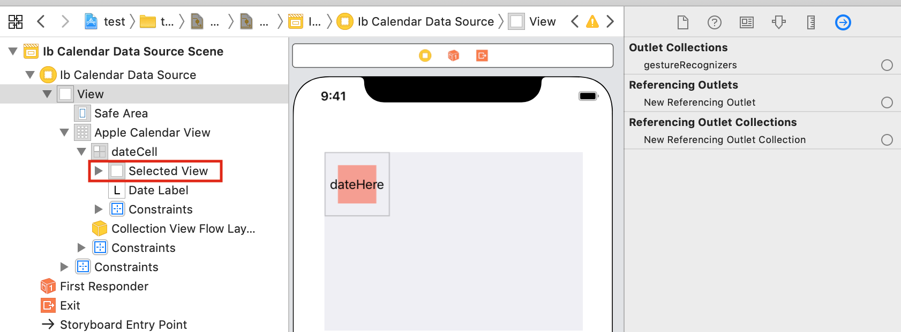

# Regular selection

> [!WARNING]
> This section requires assistance, particularly updating to SwiftUI. Please submit a PR if possible to help improve documentation

When user taps a date cell, you’ll need a highlighted UIView to show the user that the cell was selected.

We need to create a `selectedView` in the DateCell class. We’ll use this to display a red-color selection to the user.

Modify the DateCell to include the highlighted code below

```swift
class DateCell: JTAppleCell {
    @IBOutlet var dateLabel: UILabel!
    @IBOutlet var selectedView: UIView!
}
```

On storyboard, create a UIView and place it behind the UILabel so that it will not hide the label. Set color to red. It is important that you set valid constraints else it will not display correctly. I have set both width and height to be 50. I have also set the view to be centered both vertical and horizontal inside the cell.



Next, connect this UIView to the `selectedView` IBOutlet variable in the DateCell class. The `selectedView` should now be connected to the cell.

Next, Add the following highlighted code to the ViewController class

```swift
func configureCell(view: JTAppleCell?, cellState: CellState) {
    guard let cell = view as? DateCell else { return }
    cell.dateLabel.text = cellState.text
    handleCellTextColor(cell: cell, cellState: cellState)
    handleCellSelected(cell: cell, cellState: cellState)
    }

func handleCellSelected(cell: DateCell, cellState: CellState) {
    if cellState.isSelected {
    cell.selectedView.layer.cornerRadius = 13
    cell.selectedView.isHidden = false
    } else {
    cell.selectedView.isHidden = true
    }
}
```

The code is now ready to handle both selections and de-selections.

The final step is to call this function both when a cell is selected and deselected. Add the following code to the ViewController class.

```swift
func calendar(\_ calendar: JTAppleCalendarView, didSelectDate date: Date, cell: JTAppleCell?, cellState: CellState) {
    configureCell(view: cell, cellState: cellState)
}

func calendar(\_ calendar: JTAppleCalendarView, didDeselectDate date: Date, cell: JTAppleCell?, cellState: CellState) {
    configureCell(view: cell, cellState: cellState)
}
```

Other delegate functions that may be of interest are:

```swift
func calendar(\_ calendar: JTAppleCalendarView, shouldSelectDate date: Date, cell: JTAppleCell?, cellState: CellState) -> Bool {
    return true // Based on a criteria, return true or false
}
```

Very useful if you want to prevent selection.

## Next Steps

Learn more about [device rotation](../device-rotation/Handling%20Device%20Rotation.md)
