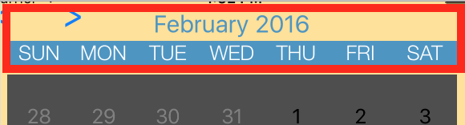
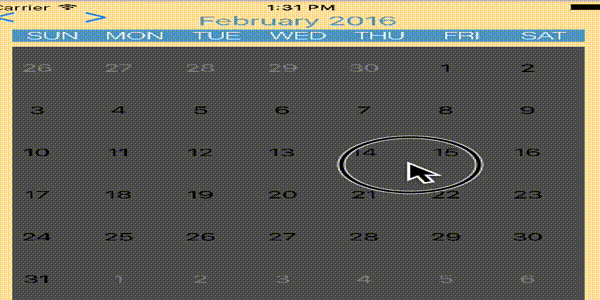
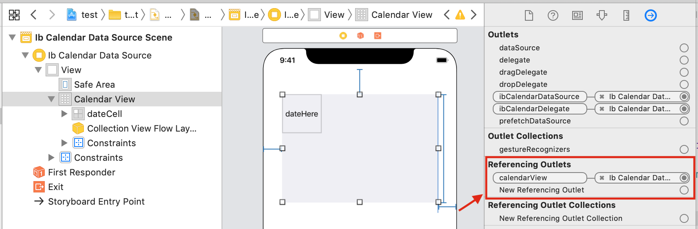
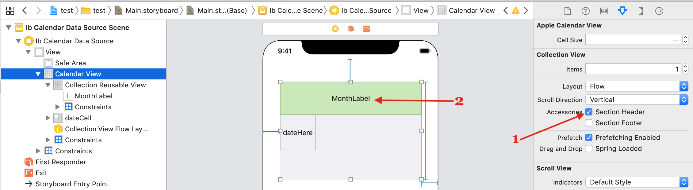
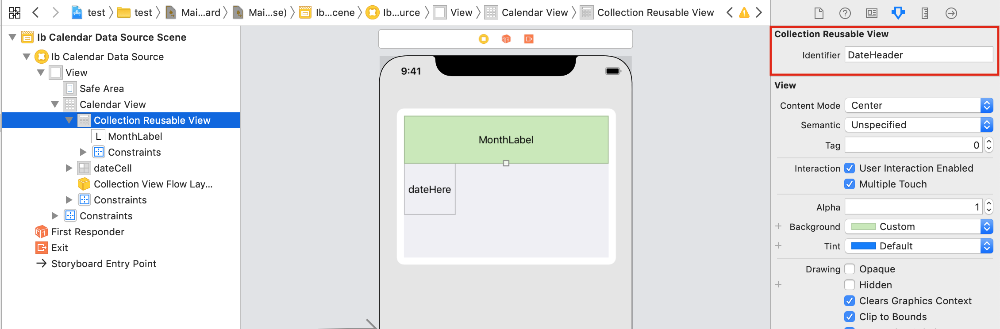

# Headers

## Outside Headers

The easiest header you can create is with a UIStackView containing 7 UILabels for the days and another label for the month.



These headers will not scroll with calendar-view (seen below) and have nothing to do with the calendar as they are created by yourself.



## Inside Headers

These are generated by the calendar. They will scroll as the user scrolls.


> [!WARNING]
> This documentation requires assistance getting up to date, especially with SwiftUI. Please submit a PR if possible to help out

### Step 1

We will use storyboard mixed with some code, but this can also be done with xibs or pure code only.

Let’s make the calendar both horizontally scrolled and paged. To do that we need a calendar IBOutlet. Add the following to the ViewController class.

```swift
class ViewController: UIViewController {
@IBOutlet var calendarView: JTAppleCalendarView!
    override func viewDidLoad() {
        super.viewDidLoad()
    }
}
```

Next, let’s connect this outlet with the calendar on storyboard.



Now, write the following code to make the calendar horizontal and paged. Keep in mind that everything in code can also be done direct via xibs/storyboard.

```swift
class ViewController: UIViewController {
@IBOutlet var calendarView: JTAppleCalendarView!
    override func viewDidLoad() {
        super.viewDidLoad()
        calendarView.scrollDirection = .horizontal
        calendarView.scrollingMode   = .stopAtEachCalendarFrame
        calendarView.showsHorizontalScrollIndicator = false
    }
}
```

If you run your project, the calendar should look better visually.

Now head back to storyboard, and let’s create the header.

### Step 2

In storyboard, click on the CollectionView and add the section header. Set the color to green and then add a UILabel. Using constraints, center the UILabel both vertically and horizontally inside of the green header.



Note, these parts should already be familiar to you because it is exactly the same as a regular UICollectionView.

Set the header’s reusable identifier to `DateHeader`



### Step 3

Now we need to create a class for the header, then set it on storyboard. Create the following class.

```swift
import UIKit
import JTAppleCalendar

class DateHeader: JTAppleCollectionReusableView {
@IBOutlet var monthTitle: UILabel!
}
```

Head to storyboard and set the header’s class to be `DateHeader`


Now connect the IBOutlet `monthTitle` to the UILabel within the header on storyboard.


4.  Finally, let’s write the header delegates. You notice this entire process is almost exactly the way headers are done in a UICollectionView.

```swift
func calendar(\_ calendar: JTAppleCalendarView, headerViewForDateRange range: (start: Date, end: Date), at indexPath: IndexPath) -> JTAppleCollectionReusableView {
    let formatter = DateFormatter() // Declare this outside, to avoid instancing this heavy class multiple times.
    formatter.dateFormat = "MMM"
    let header = calendar.dequeueReusableJTAppleSupplementaryView(withReuseIdentifier: "DateHeader", for: indexPath) as! DateHeader
    header.monthTitle.text = formatter.string(from: range.start)
    return header
}

func calendarSizeForMonths(\_ calendar: JTAppleCalendarView?) -> MonthSize? {
    return MonthSize(defaultSize: 50)
}
```

Now run your app. You should have a working calendar with an implemented header.

## Next Steps

Find out more about [range selection style](../range-selection-styles/Range%20selection%20styles.md)
