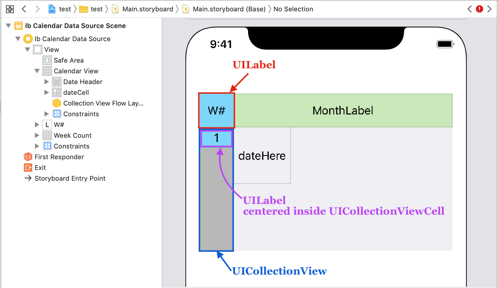
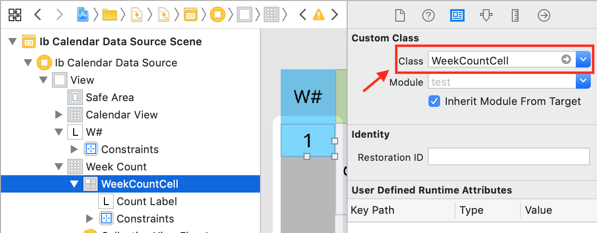
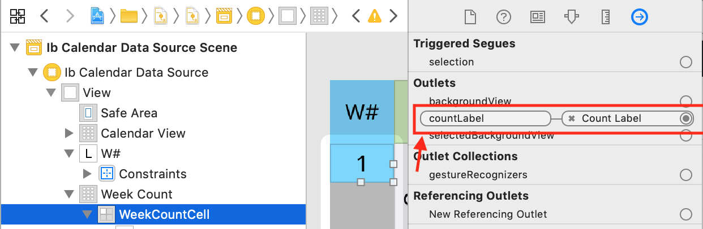

# Implementing week numbers

> [!WARNING]
> This documentation requires assistance, particularly updating to SwiftUI. If possible, please submit a PR to help improve the documentation

This library does not come with week numbers built in. However building one is easy.

## Design the views

First we need to design the week number views. Head to storyboard and modify it to be similar to the image below.



A UILabel for the week number was added on top. A UICollectionView added below to hold the week numbers. Finally a UILabel was centered inside the UICollectionViewCell. Add proper constraints so that it appears visually as shown.

## Setup week-number cells

Create a week number cell class to display the numbers.

```swift
import UIKit

class WeekCountCell: UICollectionViewCell {
    @IBOutlet var countLabel: UILabel!
}
```

Now that we have our cell class, head to storyboard and set the class of the cell inside the UICollectionView to be `WeekCountCell`



Now that the class is set, connect the label IBOutlet to `countLabel`

## Setup the UICollectionView

With the cell setup complete, let’s configure the collectionView. Create an IBOutlet for it in the ViewController subclass.

> [!WARNING]
> The old documentation includes the following section verbatim, but the code may be incomplete. Please use caution when following, and if it is incorrect, submit an issue or PR to improve this documentation

```swift
class ViewController: UIViewController {
    @IBOutlet var calendarView: JTAppleCalendarView!
    @IBOutlet var weekCount: UICollectionView!

    override func viewDidLoad() {
```

Connect the UICollectionView’s reference outlet to `weekCount`. Also set its `dataSource` and delegate to be ViewController as seen below.



## Final Setup code

Head to the ViewController class and add the following code. We will assume that a year does not have more than 55 weeks.

```swift
extension ViewController: UICollectionViewDataSource, UICollectionViewDelegate {
    func collectionView(_ collectionView: UICollectionView, numberOfItemsInSection section: Int) -> Int {
        return 55
    }

    func collectionView(_ collectionView: UICollectionView, cellForItemAt indexPath: IndexPath) -> UICollectionViewCell {
        let cell = collectionView.dequeueReusableCell(withReuseIdentifier: "WeekCountCell", for: indexPath) as! WeekCountCell
        cell.countLabel.text = "\(indexPath.item + 1)"
        return cell
    }
}
```

Finally, we need this code to be run every time the user swipes the calendar. Therefore we will put in the willScroll delegate function. It will look better visually if placed there than if it were placed in the didScroll delegate function. Place the following code after the willDisplay function as shown below.

> [!WARNING]
> The old documentation includes the following section verbatim, but the code may be incomplete. Please use caution when following, and if it is incorrect, submit an issue or PR to improve this documentation

```swift
func calendar(_ calendar: JTAppleCalendarView, willDisplay cell: JTAppleCell, forItemAt date: Date, cellState: CellState, indexPath: IndexPath) {
    configureCell(view: cell, cellState: cellState)
}

func calendar(_ calendar: JTAppleCalendarView, willScrollToDateSegmentWith visibleDates: DateSegmentInfo) {
    let date: Date = visibleDates.monthDates.first!.date
    let weekNumber = Calendar.current.component(.weekOfYear, from: date)
    weekCount.scrollToItem(at: IndexPath(item: weekNumber - 1, section: 0), at: .top, animated: true)
}

func calendar(_ calendar: JTAppleCalendarView, headerViewForDateRange range: (start: Date, end: Date), at indexPath: IndexPath) ->; JTAppleCollectionReusableView {
```
