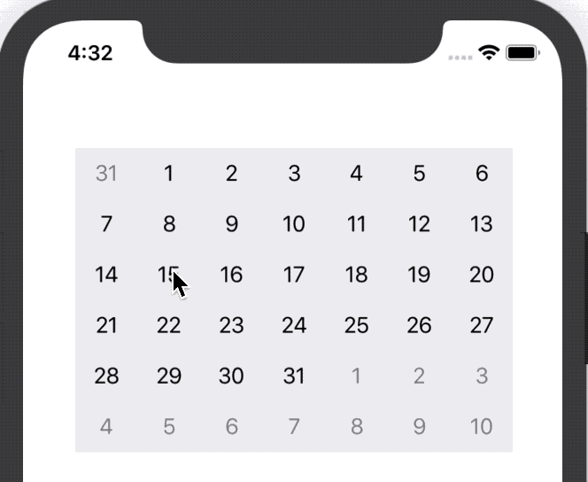
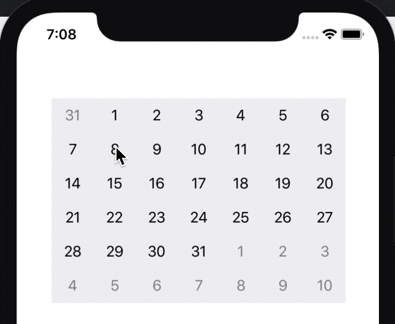
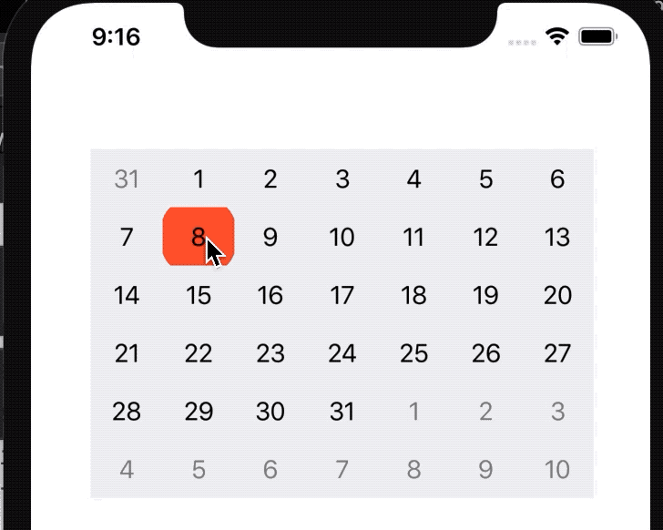

# Range selection styles

> [!WARNING]
> This documentation requires assistance, particularly updating to SwiftUI. If possible, please submit a PR to help improve the documentation

## Single tap range selection



First let’s create an outlet for the calendarView. Add the following line and connect the IBOutlet to the calendarView on Storyboard.

```swift
import UIKit
import JTAppleCalendar

class ViewController: UIViewController {
    @IBOutlet var calendarView: JTAppleCalendarView!
}
```


Now add the following code.

```swift
override func viewDidLoad() {
   super.viewDidLoad()
   calendarView.allowsMultipleSelection = true
   calendarView.isRangeSelectionUsed = true
}
```

Multiple selection is needed to multi-select. Informing that range-selection will be used makes the calendar refresh cells both to the left and right of a selected cell to update its selectedView.

The final code needed for range selection is below. Modify the function to the following.

```swift
func handleCellSelected(cell: DateCell, cellState: CellState) {
    cell.selectedView.isHidden = !cellState.isSelected
    switch cellState.selectedPosition() {
    case .left:
        cell.selectedView.layer.cornerRadius = 20
        cell.selectedView.layer.maskedCorners = [.layerMinXMaxYCorner, .layerMinXMinYCorner]
    case .middle:
        cell.selectedView.layer.cornerRadius = 0
        cell.selectedView.layer.maskedCorners = []
    case .right:
        cell.selectedView.layer.cornerRadius = 20
        cell.selectedView.layer.maskedCorners = [.layerMaxXMaxYCorner, .layerMaxXMinYCorner]
    case .full:
        cell.selectedView.layer.cornerRadius = 20
        cell.selectedView.layer.maskedCorners = [.layerMaxXMaxYCorner, .layerMaxXMinYCorner, .layerMinXMaxYCorner, .layerMinXMinYCorner]
    default: break
    }
}
```

The selected view was morphed in this example for simplicity, but you can customize your view to anything.

This library determines a reasonable setting for what each cell’s selectedPosition should be. If your app needs something other than this default, then, you will have to implement it your self based on your own criteria.

## Drag to select range



This example requires the `UITapGestureRecornizer` in order to work. We’ll start by modifying the following code:

```swift
class ViewController: UIViewController {

    @IBOutlet var calendarView: JTAppleCalendarView!
    let testCalendar = Calendar(identifier: .gregorian)

    override func viewDidLoad() {
        super.viewDidLoad()

        calendarView.allowsMultipleSelection = true
        calendarView.isRangeSelectionUsed = true

        let panGensture = UILongPressGestureRecognizer(target: self, action: #selector(didStartRangeSelecting(gesture:)))
        panGensture.minimumPressDuration = 0.5
        calendarView.addGestureRecognizer(panGensture)
    }
}
```

Note that we set the minimum press duration to 0.5 seconds. This means you need to press the cell for at least 0.5 seconds before drag-selection can begin. Also note the need for the `testCalendar` instance. We use this variable for date calculations in the function below.

Finally, add the following function.

```swift
@objc func didStartRangeSelecting(gesture: UILongPressGestureRecognizer) {
    let point = gesture.location(in: gesture.view!)
    let rangeSelectedDates = calendarView.selectedDates

    guard let cellState = calendarView.cellStatus(at: point) else { return }

    if !rangeSelectedDates.contains(cellState.date) {
        let dateRange = calendarView.generateDateRange(from: rangeSelectedDates.first ?? cellState.date, to: cellState.date)
        calendarView.selectDates(dateRange, keepSelectionIfMultiSelectionAllowed: true)
    } else {
        let followingDay = testCalendar.date(byAdding: .day, value: 1, to: cellState.date)!
        calendarView.selectDates(from: followingDay, to: rangeSelectedDates.last!, keepSelectionIfMultiSelectionAllowed: false)
    }
}
```

The code above is just an example. If your drag-selection needs to behave differently, then please modify to suite your needs.

## Select range via multiple taps



> [!CAUTION]
> This section is not available from the original docs source. If you can, please submit a PR to update this section

## Next Steps

Learn more about [events and loading information from a server](../adding-events/Adding%20Events.md)
