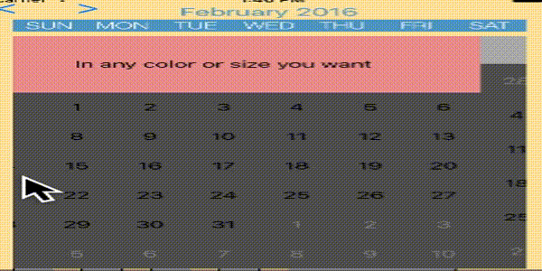
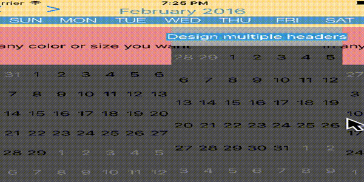
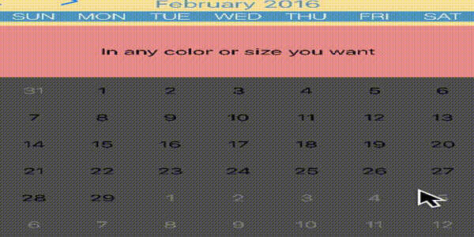

# Scrolling modes

> [!WARNING]
> This section requires assistance. Please submit a PR if possible to help improve documentation

There are 7 modes.

calendarView.scrollingMode =

1. stopAtEachCalendarFrame

Non-continuous scrolling. Calendar will stop scrolling when it has scrolled a distance of frame.width, before accepting another scroll.

2. stopAtEachSection

Non-continuous scrolling. Calendar will stop scrolling when it has scrolled a distance of a section’s width, before accepting another scroll. Months can be divided into sections depending on how many rows per month you chose to display.

3. stopAtEach(customInterval: CGFloat)

Non-continuous scrolling. Calendar will stop scrolling at every point where your set interval has been reached.

4. nonStopToSection(withResistance: CGFloat)

Continuous scrolling. Calendar will smoothly scroll and gradually decelerate. When stopped, it will snap to a section. Deceleration rate is based on resistance value (from 0.0 to 1.0)

5. nonStopToCell(withResistance: CGFloat)

Continuous scrolling. Calendar will smoothly scroll and gradually decelerate. When stopped, it will snap to a cell. Deceleration rate is based on resistance value (from 0.0 to 1.0)

6. nonStopTo(customInterval: CGFloat, withResistance: CGFloat)

Continuous scrolling. Calendar will smoothly scroll and gradually decelerate. When stopped, it will snap to your set custom interval. Deceleration rate is based on resistance value (from 0.0 to 1.0)

7. none

Continuous scrolling. Calendar will smoothly scroll and gradually decelerate till it stops.

# Next Steps

Learn how to [switch between month-view and week-view](../switch-month-to-week-view/Switch%20between%20month-view%20and%20week-view.md)
