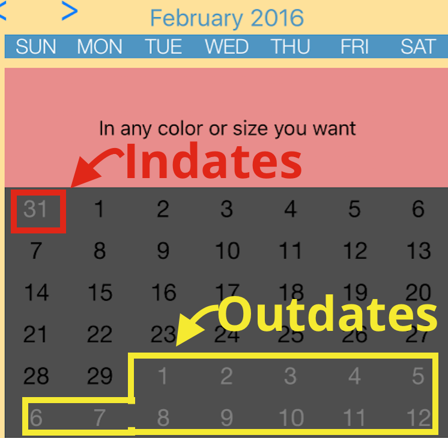
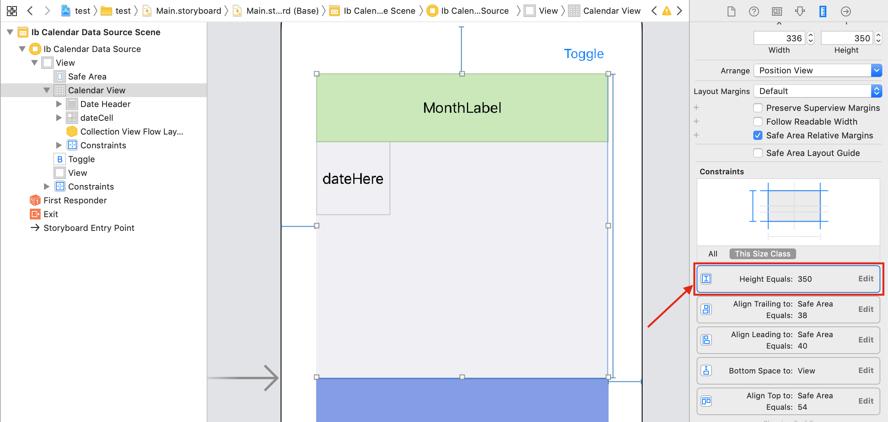
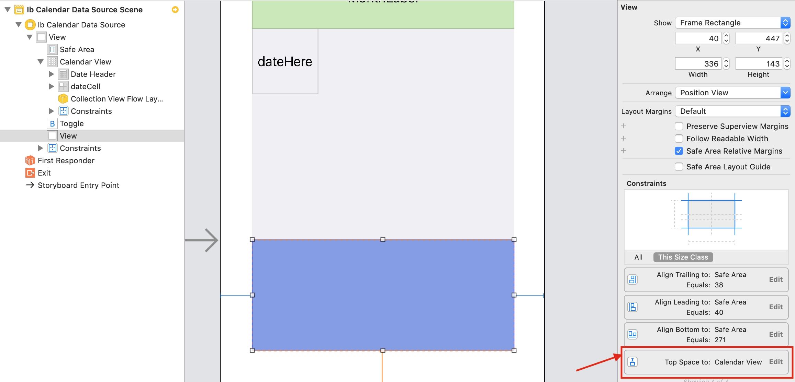
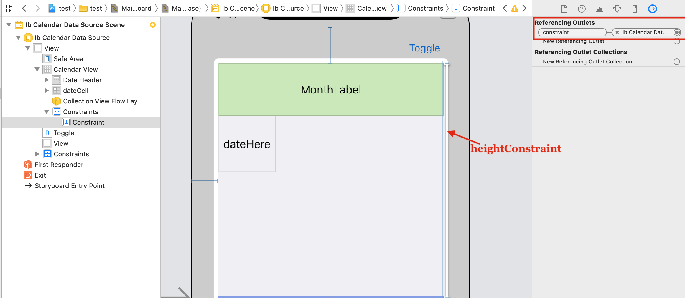
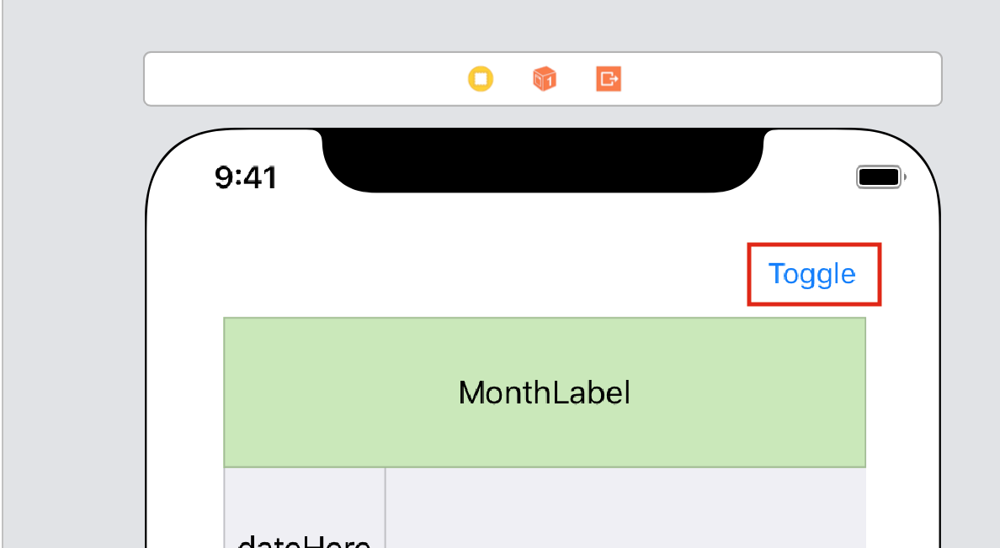

# Switch between month-view and week-view

> [!WARNING]
> This documentation requires assistance, particularly updating to SwiftUI. If possible, please submit a PR to help improve the documentation

This library has no concept of week/month view. You as the developer will need to define this. For this example, we will change state between a 6-row calendar and a 1-row calendar.

Switching between a 6-row and 1-row calendar is pretty simple. First we’ll look at the configuration. Then we’ll look at the animation.

## Configuration



It is important to remember that if you switch your calendar from 6 rows to 1, the inDates/outDates will make your 1 row calendar look as if dates are being repeated.

Although you can make your 1-row calendar with what ever design you want, the regular 6 row configuration will not work on a 1 row calendar for 90% of developers. This is because of the inDates/outDates shown above.

Here is a proper configuration for a 1 row calendar

```swift
let parameters = ConfigurationParameters(
                    startDate: startDate,
                    endDate: endDate,
                    numberOfRows: 1,
                    generateInDates: .forFirstMonthOnly,
                    generateOutDates: .off,
                    hasStrictBoundaries: false
                )
```

Therefore, modify your `configureCalendar` function to have the following code

```swift
func configureCalendar(_ calendar: JTAppleCalendarView) -> ConfigurationParameters {
    let formatter = DateFormatter()
    formatter.dateFormat = "yyyy MM dd"

    let startDate = formatter.date(from: "2018 01 01")!
    let endDate = Date()

    if numberOfRows == 6 {
        return ConfigurationParameters(startDate: startDate, endDate: endDate, numberOfRows: numberOfRows)
    } else {
        return ConfigurationParameters(startDate: startDate,
                                       endDate: endDate,
                                       numberOfRows: numberOfRows,
                                       generateInDates: .forFirstMonthOnly,
                                       generateOutDates: .off,
                                       hasStrictBoundaries: false)
    }
}
```

## Animation

It all has to do with constraints.

Go to storyboard and modify the height constraint of the calendar to 350.



Next create a blue colored view at the bottom of the calendar. Make its left, right and bottom constraints fixed. But make it’s top constraint to sit right below the collectionView with zero (0) space. This view represents the view below the calendarView that you will build in your real app. See its completed constraints below.



The views are now ready. What we now need is an outlet to the hight-constraint for the calendar. Click on the height constraint of the CollectionView and create an IBOutlet for it in your view controller class.



The created IBOutlet should be called constraint in your ViewController subclass. Also add a new variable called numberOfRows. We will use this to change the row number. Below shows both added code.

```swift
class ViewController: UIViewController {
    @IBOutlet var calendarView: JTAppleCalendarView!
    @IBOutlet weak var constraint: NSLayoutConstraint!

    var numberOfRows = 6
}
```

Finally create a toggle button on storyboard



and connect its IBAction to the following code

```swift
@IBAction func toggle(_ sender: Any) {
    if numberOfRows == 6 {
        self.constraint.constant = 58.33
        self.numberOfRows = 1
        UIView.animate(withDuration: 0.2, animations: {
            self.view.layoutIfNeeded()
        }) { completed in
            self.calendarView.reloadData(withanchor: Date())
        }
    } else {
        self.constraint.constant = 350
        self.numberOfRows = 6

        UIView.animate(withDuration: 0.2, animations: {
            self.view.layoutIfNeeded()
            self.calendarView.reloadData(withanchor: Date())
        })
    }
}
```

In the code above we set the `anchorDate` to be the current date, but you can set it to what ever date you wish. `anchorDate` is the date the calendar will focus on once the number of rows change. This parameter is optional. Remove if not needed.

Finally delete the following 2 functions and run the app. These header functions are removed for simplicity. A new tutorial will be created on how headers affect 1 row calendars

```swift
func calendar(_ calendar: JTAppleCalendarView, headerViewForDateRange range: (start: Date, end: Date), at indexPath: IndexPath) -> JTAppleCollectionReusableView {}
func calendarSizeForMonths(_ calendar: JTAppleCalendarView?) -> MonthSize? {}
```

## Next Steps

Find out more about [headers](../headers/Headers.md)
